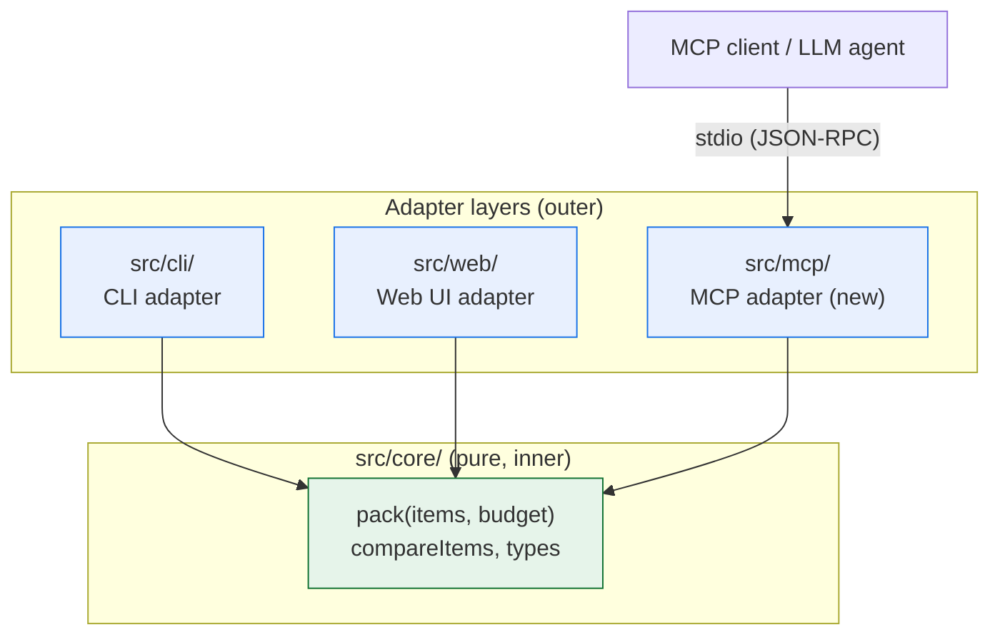
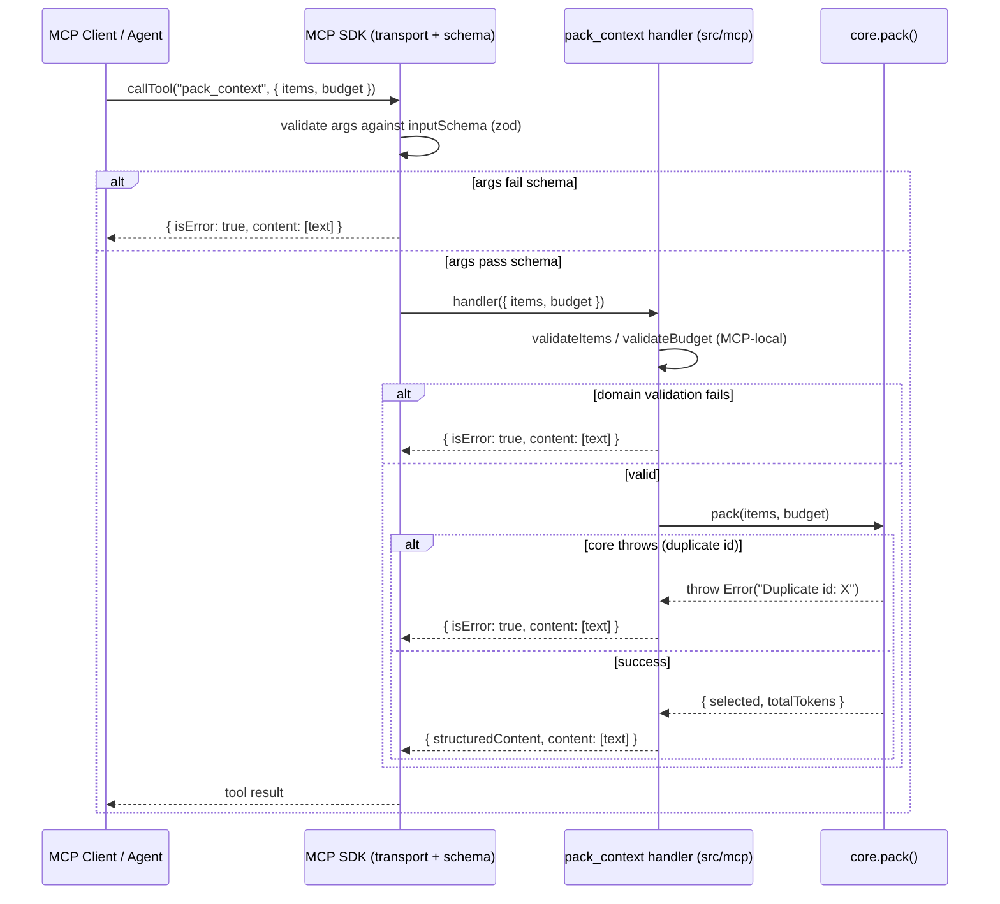

# Design Document

## Overview

`ctxpack-mcp` adds a stdio Model Context Protocol (MCP) server as a new adapter
layer at `src/mcp/`. The server exposes a single tool, `pack_context`, that lets
an LLM agent invoke ctxpack's deterministic packing over the MCP protocol — no
network, no database, fully local.

The MCP layer is a thin adapter, exactly like `src/cli/`. It performs three jobs
and nothing else:

1. **Validate and shape input** received from the MCP client.
2. **Delegate selection** to the pure core `pack(items, budget)`.
3. **Shape the result** back into an MCP tool response (structured content plus a
   text summary).

All selection logic stays in `src/core/`. The core does not change, and the MCP
layer never reimplements sorting or budget arithmetic. This keeps every surface
(CLI, Web, MCP) consistent because they all funnel through the same pure
function.

### Research summary

The design is grounded in the official TypeScript MCP SDK
([`@modelcontextprotocol/sdk`](https://www.npmjs.com/package/@modelcontextprotocol/sdk),
latest `1.30.1` at time of writing) and its
[tools guide](https://ts.sdk.modelcontextprotocol.io/v2/servers/tools). Key
findings that shaped the design (content rephrased for compliance with licensing
restrictions):

- A server is built with `McpServer` and connected to a transport; for local
  process-to-process use that transport is `StdioServerTransport`.
- Tools are registered with `server.registerTool(name, config, handler)`. The
  `config` carries a `description`, a zod-based `inputSchema`, and optionally an
  `outputSchema`.
- The SDK derives the advertised JSON Schema, validates incoming arguments
  against `inputSchema` before the handler runs, and infers the handler's
  argument types from that one schema.
- Arguments that fail the schema come back to the client as an ordinary tool
  result with `isError: true` — the handler never runs. This is the same channel
  we use for our own domain validation errors, so the server stays alive.
- A handler returns `content` (human-readable blocks, e.g. `{ type: 'text' }`)
  and may additionally return `structuredContent` validated against
  `outputSchema`.
- The SDK peer-depends on `zod` (`^3.25 || ^4.0`), which we add as a runtime
  dependency alongside the SDK.

These findings mean the MCP layer can lean on the SDK for transport, handshake,
tools/list, and unknown-tool handling, and focus its own code on validation +
delegation + response shaping.

## Architecture

The MCP server is an outer adapter. Dependencies point strictly inward: the MCP
layer imports only from `core`; it never imports from `cli` or `web`, and `core`
never imports from any adapter.



### Request lifecycle



### Design decisions and rationale

- **New `src/mcp/` layer, mirroring `src/cli/`.** The steering rules require
  adapter isolation: `mcp -> core` only. A new sibling directory keeps the CLI,
  Web, and MCP surfaces symmetric and independent.
- **MCP-local validation rather than shared validation.** The CLI's validation
  lives in `src/cli/load.ts` (`CliInputError`, `validateItem`, `parseBudget`).
  The MCP layer must not import from `src/cli` (dependency rule). Three options
  were considered:
  1. Import CLI validators from `src/mcp` — **rejected**, violates
     `mcp -> core only`.
  2. Move shared validation into `src/core` — **rejected**. It would either add
     adapter-flavored input-parsing concerns (string budget parsing, MCP/CLI
     error types) into the pure core, or force the core to grow a new error
     type. Both couple the core to adapter concerns and dilute its purity, which
     the product/tech steering explicitly protects.
  3. Implement MCP-local validation that mirrors the CLI rules — **chosen**. A
     small `validate.ts` in `src/mcp/` duplicates the *rules* (not the code):
     `id` is a string, `priority` is a finite number, `tokens` is a non-negative
     integer, `budget` is a non-negative integer. The duplication is a few lines
     and keeps the core pure and the adapters decoupled. This matches the
     existing pattern where each adapter owns its own input handling.
- **Two-stage validation (schema + domain).** The SDK's zod `inputSchema` gives
  a first, coarse gate (types and basic shape) and its failures already surface
  as `isError` results. We still run explicit domain validation in the handler
  so that (a) error messages are deterministic and describe the exact violated
  constraint (Req 3.1, 3.2), and (b) integer/non-negative constraints on
  `tokens` and `budget` are enforced identically to the CLI regardless of how
  strict the schema is. The handler treats validation as authoritative.
- **Errors as tool results, not thrown exceptions.** Every recoverable
  problem — bad item shape, bad budget, duplicate id from core — becomes a tool
  result flagged `isError: true`. The handler never lets these escape, so the
  process keeps serving (Req 3.4). Only a startup/transport failure is fatal and
  exits non-zero (Req 1.5).

## Components and Interfaces

All files are TypeScript, ESM, Node 20+. Relative imports use the `.js`
extension in source, matching the existing files (e.g. `../core/index.js`).

### File / module layout

```
src/mcp/
├── index.ts       # Process entry: build server, connect stdio, exit non-zero on failure
├── server.ts      # Builds McpServer and registers the pack_context tool (no process globals)
├── handler.ts     # pack_context handler: validate -> delegate to core.pack -> shape result
└── validate.ts    # McpInputError + validateItems / validateBudget (mirrors CLI rules)

tests/mcp/
├── validate.test.ts   # Unit + property tests for input validation
├── handler.test.ts    # Unit tests for the handler (success, empty, error paths)
└── handler.property.test.ts  # Property tests: delegation fidelity, error safety
```

Rationale for splitting `server.ts` from `index.ts`: the CLI separates `run.ts`
(pure orchestration, returns values, no process globals) from `index.ts`
(process plumbing). We mirror that so the server wiring and the handler are
unit-testable via an in-memory client without spawning a process.

### `validate.ts`

Mirrors `src/cli/load.ts` validation rules but with an MCP-specific error type.

```ts
/** Recoverable MCP input error. The handler catches it and returns an isError result. */
export class McpInputError extends Error {
  constructor(message: string) {
    super(message);
    this.name = 'McpInputError';
  }
}

/**
 * Validate an unknown value as an Item[]:
 *  - id: string
 *  - priority: finite number
 *  - tokens: integer >= 0
 * @throws {McpInputError} describing the first violated constraint.
 */
export function validateItems(value: unknown): Item[];

/**
 * Validate a budget value: it must be an integer >= 0.
 * @throws {McpInputError} describing the invalid budget.
 */
export function validateBudget(value: unknown): number;
```

Note: unlike the CLI's `parseBudget` (which parses a *string* argument), the MCP
budget arrives as a JSON number, so `validateBudget` checks
`Number.isInteger(value) && value >= 0` (and `Number.isSafeInteger` for the
upper bound) rather than a regex.

### `handler.ts`

```ts
export interface PackContextInput {
  items: unknown;   // validated inside the handler
  budget: unknown;  // validated inside the handler
}

export interface PackContextOutput {
  selectedIds: string[];  // deterministic order from core
  totalTokens: number;
  budget: number;         // the applied budget
}

/**
 * Handle a pack_context call. Never throws: any McpInputError, any duplicate-id
 * Error from core, or any other error is converted into an isError tool result.
 */
export function handlePackContext(input: PackContextInput): CallToolResult;
```

Flow inside `handlePackContext`:

1. `const items = validateItems(input.items)` — throws `McpInputError` on bad
   shape (Req 3.1).
2. `const budget = validateBudget(input.budget)` — throws `McpInputError` on a
   non-integer/negative budget (Req 3.2).
3. `const result = pack(items, budget)` — may throw `Error("Duplicate id: X")`
   (Req 3.3).
4. Build success result: map `result.selected` to `selectedIds`, include
   `result.totalTokens` and the applied `budget`, and a text summary.
5. Wrap steps 1–3 in `try/catch`; any error becomes
   `{ isError: true, content: [{ type: 'text', text: message }] }` (Req 3.4,
   3.5).

### `server.ts`

```ts
/** Build the MCP server and register the single pack_context tool. */
export function buildServer(): McpServer;
```

Registers exactly one tool (Req 1.3, 1.4):

```ts
server.registerTool(
  'pack_context',
  {
    description: 'Deterministically select items that fit a token budget.',
    inputSchema: {
      items: z.array(z.object({
        id: z.string(),
        priority: z.number(),
        tokens: z.number().int().nonnegative(),
      })).describe('Candidate items to pack.'),
      budget: z.number().int().nonnegative()
        .describe('Maximum total tokens (non-negative integer).'),
    },
    outputSchema: {
      selectedIds: z.array(z.string()),
      totalTokens: z.number().int().nonnegative(),
      budget: z.number().int().nonnegative(),
    },
  },
  async (args) => handlePackContext(args),
);
```

The zod schema is the first-line gate; the handler's `validate.ts` calls are the
authoritative, deterministic gate that produces the exact error messages.
Unknown tool names are handled by the SDK, which returns a tool error and keeps
the server running (Req 1.6).

### `index.ts` (process entry)

```ts
export async function main(): Promise<void> {
  const server = buildServer();
  const transport = new StdioServerTransport();
  await server.connect(transport); // rejects if transport init fails
}
```

- On success the server listens over stdio (Req 1.1, 4.2, 4.3).
- If `connect` rejects (transport init failure), `main` lets the rejection
  propagate; the entry catches it, writes an error to stderr, and calls
  `process.exit(1)` (Req 1.5).
- Guarded with the same `import.meta.url === \`file://${process.argv[1]}\``
  pattern as the CLI so importing the module in tests does not start the server.
- If the compiled output is missing, `node dist/mcp/index.js` fails to resolve
  the module and Node exits non-zero with a "cannot find module" message — this
  satisfies Req 4.4 without extra code (documented in Testing Strategy).

## Data Models

The MCP layer reuses the core types unchanged and adds thin
request/response shapes.

### Reused from core (`src/core/index.ts`, unchanged)

```ts
interface Item { id: string; priority: number; tokens: number }
interface PackResult { selected: Item[]; totalTokens: number }
function pack(items: Item[], budget: number): PackResult // throws on duplicate id
```

### `pack_context` tool contract

**Input** (validated by zod schema, then by `validate.ts`):

| Field    | Type                                              | Constraint                          |
|----------|---------------------------------------------------|-------------------------------------|
| `items`  | array of `{ id: string; priority: number; tokens: number }` | `tokens` integer >= 0; ids unique   |
| `budget` | number                                            | integer >= 0                        |

**Output** (`structuredContent`, validated by `outputSchema`) on success:

| Field         | Type       | Meaning                                             |
|---------------|------------|-----------------------------------------------------|
| `selectedIds` | `string[]` | ids of selected items in core's deterministic order |
| `totalTokens` | `number`   | sum of tokens across the selection                  |
| `budget`      | `number`   | the budget that was applied                         |

Alongside `structuredContent`, the handler returns a human-readable
`content: [{ type: 'text', text }]` summary (e.g. the selected ids and total).

**Error output** (any invalid input or duplicate id):

```jsonc
{ "isError": true, "content": [{ "type": "text", "text": "<message>" }] }
```

Empty input is valid, not an error: an empty `items` list or `budget` of `0` is
delegated to core, which returns an empty selection with `totalTokens: 0`
(Req 2.5, 3.6).

## Correctness Properties

*A property is a characteristic or behavior that should hold true across all
valid executions of a system — essentially, a formal statement about what the
system should do. Properties serve as the bridge between human-readable
specifications and machine-verifiable correctness guarantees.*

The MCP layer is a pure delegating adapter over `core.pack`, so its correctness
reduces to three universal statements: it faithfully forwards core's result,
it never crashes on bad input, and it surfaces core's duplicate-id failure as a
tool error. The following properties were derived from the prework analysis;
several acceptance criteria were consolidated to remove redundancy (see the
mapping under each property).

### Property 1: Delegation fidelity

*For any* array of valid items (unique ids; each with a string id, a finite
number priority, and a non-negative integer tokens) and *any* non-negative
integer budget, the `pack_context` result is a success result whose
`selectedIds` equals the ids of `core.pack(items, budget).selected` in the same
order, whose `totalTokens` equals `core.pack(items, budget).totalTokens`, and
whose `budget` equals the input budget. The adapter adds, removes, and reorders
nothing.

**Validates: Requirements 2.1, 2.2, 2.3, 2.4, 2.5, 3.6**

### Property 2: Error safety and no-crash on invalid input

*For any* invalid input (items that are not a list of well-formed items, or a
budget that is not a non-negative integer), the `pack_context` handler returns a
result flagged `isError: true` carrying a descriptive text message, never throws
out of the handler, and carries no selection payload; the server remains able to
answer a subsequent valid request.

**Validates: Requirements 3.1, 3.2, 3.4, 3.5**

### Property 3: Duplicate ids surface as a tool error naming the id

*For any* items array that contains two or more items sharing the same id (and
an otherwise valid budget), the `pack_context` handler catches the error raised
by `core.pack`, returns a result flagged `isError: true` whose message includes
the duplicated id, and does not throw.

**Validates: Requirements 3.3**

## Error Handling

The MCP layer distinguishes two error tiers.

**Recoverable (tool-result) errors — server keeps running.** These are returned
as `{ isError: true, content: [{ type: 'text', text: message }] }` and never
thrown out of the handler:

| Source                         | Detection                                   | Message intent                        | Req      |
|--------------------------------|---------------------------------------------|---------------------------------------|----------|
| Malformed item shape           | `validateItems` throws `McpInputError`      | which field/constraint failed         | 3.1      |
| Invalid budget                 | `validateBudget` throws `McpInputError`     | the invalid budget value              | 3.2      |
| Duplicate id                   | `core.pack` throws `Error("Duplicate id: X")` | names the duplicated id             | 3.3      |
| Unknown tool name              | Handled by the SDK                          | tool not recognized                   | 1.6      |
| Args fail zod `inputSchema`    | Handled by the SDK before the handler runs  | SDK validation message                | 3.1, 3.2 |

The handler wraps validation and the `pack` call in a single `try/catch`. Any
`Error` (whether `McpInputError` or the core's duplicate-id `Error`) is mapped to
an `isError` result using `err instanceof Error ? err.message : String(err)` —
the same defensive extraction the CLI's `run.ts` uses. After returning an error
result, the server is untouched and serves the next request (Req 3.4). Error
results never include `structuredContent`, so no selection leaks (Req 3.5).

**Fatal (startup) errors — process exits non-zero.** If the stdio transport
fails to initialize (`server.connect(transport)` rejects), the entry point
catches it, writes a description to stderr, and exits with a non-zero code
(Req 1.5). If the compiled entry is missing, Node's own module resolution fails
and exits non-zero before any listening begins (Req 4.4).

## Testing Strategy

Tests use Vitest (`vitest --run`) and live under `tests/mcp/`, mirroring
`src/mcp/`. Property tests use `fast-check` (already a dev dependency). The
handler and server are exercised through the SDK's in-memory client/transport
pair so no process is spawned for the core behavior tests.

### Property-based tests (fast-check, minimum 100 iterations each)

Each property test references its design property with a tag comment in the
form **Feature: ctxpack-mcp, Property {n}: {property text}** and runs at least
100 iterations.

- **Property 1 — Delegation fidelity** (`tests/mcp/handler.property.test.ts`).
  Generator: arrays of items with unique ids (fast-check `uniqueArray` keyed on
  `id`), `priority` as an arbitrary finite number (including negatives and
  ties), `tokens` as a non-negative integer, and `budget` as a non-negative
  integer whose range spans below, at, and above the total token sum. For each
  sample, call the handler and call `core.pack(items, budget)` directly, then
  assert `selectedIds` equals `selected.map(i => i.id)` in order, `totalTokens`
  matches, and `budget` echoes the input. Generators deliberately include the
  empty-items case and `budget === 0` to cover Requirements 2.5 and 3.6.

- **Property 2 — Error safety / no-crash**
  (`tests/mcp/handler.property.test.ts`). Generator: invalid inputs — items that
  are not arrays, items missing/mistyping `id`/`priority`/`tokens` (e.g. numeric
  id, non-integer or negative tokens, NaN priority), and invalid budgets
  (negative, fractional, NaN, non-number). Assert the handler does not throw,
  the result has `isError === true`, it contains a non-empty text message, and
  it has no selection payload. Additionally assert that after any such error the
  handler answers a subsequent known-valid input with a success result (the
  no-crash / stays-responsive part).

- **Property 3 — Duplicate ids** (`tests/mcp/handler.property.test.ts`).
  Generator: a valid items array of length >= 1, then clone one element's `id`
  onto another element to force a duplicate; pair with a valid budget. Assert
  the handler does not throw, returns `isError === true`, and the message
  contains the duplicated id.

### Unit tests (specific examples, edge cases, configuration)

- **Handler examples** (`tests/mcp/handler.test.ts`): a concrete success case
  with a known selection; the empty-items case returning `[]`/`0` (Req 2.5); the
  `budget === 0` case (Req 3.6); one explicit malformed-item message check; one
  explicit invalid-budget message check.
- **Validation units** (`tests/mcp/validate.test.ts`): representative accept and
  reject examples for `validateItems` and `validateBudget`, mirroring the CLI's
  `load.test.ts` coverage (non-integer tokens, negative tokens, non-string id,
  non-finite priority, negative/fractional budget).
- **Tool registration** (`tests/mcp/server.test.ts` or within `handler.test.ts`):
  connect an in-memory client, list tools, assert exactly one tool named
  `pack_context` whose input schema advertises `items` and `budget`
  (Req 1.3, 1.4); call an unknown tool name and assert an `isError` result plus
  that a following valid call still succeeds (Req 1.6).
- **Config check** (`tests/mcp/config.test.ts`): read `.kiro/settings/mcp.json`,
  assert it parses, registers `ctxpack` with `command: "node"` and args
  referencing `dist/mcp/index.js`, `disabled: false`, and
  `autoApprove` deep-equals `["pack_context"]` (Req 5.1–5.5). Also assert
  `package.json` exposes the single start script pointing at the compiled entry
  (Req 4.1).

### Integration / smoke tests (1–3 examples, not property-based)

- **Handshake / stdio** (Req 1.1, 4.2, 4.3): connect an in-memory client to the
  built server and complete the handshake; optionally a spawn-based smoke test
  that starts `node dist/mcp/index.js` and performs one `pack_context` round
  trip.
- **Startup failure** (Req 1.5): inject a transport whose init rejects into
  `main` and assert the returned promise rejects / the entry exits non-zero.
- **Missing compiled output** (Req 4.4): documented as a manual/optional check —
  running `node dist/mcp/index.js` when `dist/` is absent exits non-zero with a
  module-not-found message.

### Why the correctness properties are limited to the delegation layer

Most acceptance criteria in Requirements 1, 4, and 5 concern transport wiring,
process startup, package scripts, and static config. These do not vary with
input and are not YOUR-code algorithms, so per the PBT decision guide they are
covered by smoke/integration/example tests rather than property tests. The only
input-varying, algorithmic behavior in this layer is delegation and error
handling, captured by Properties 1–3.

## Build and Run

- **Compilation.** `tsconfig.json` sets `rootDir: "src"` and `outDir: "dist"`
  and includes `src`, so `src/mcp/index.ts` compiles to `dist/mcp/index.js`
  under the existing `npm run build` (`tsc && vite build`). `tsc` compiles all
  of `src` (including the new `src/mcp/`); `vite build` continues to handle only
  the web bundle. No tsconfig change is required.
- **Start script.** Add one script to `package.json`, e.g.
  `"start:mcp": "node dist/mcp/index.js"` (Req 4.1). It runs only after
  `npm run build` has produced `dist/mcp/index.js`; run before build, Node exits
  non-zero (Req 4.4).
- **Dependencies.** Add `@modelcontextprotocol/sdk` (latest `1.30.1`) and its
  peer `zod` as normal runtime `dependencies` (the project currently has none).
  Pin exact versions to match the repo's pinned-dependency convention
  (`fast-check`, `@types/node` are pinned).

### Workspace MCP config (`.kiro/settings/mcp.json`)

Registered at workspace level (workspace config merges over and takes precedence
over user-level config, which is the intended behavior here):

```json
{
  "mcpServers": {
    "ctxpack": {
      "command": "node",
      "args": ["dist/mcp/index.js"],
      "disabled": false,
      "autoApprove": ["pack_context"]
    }
  }
}
```

This registers the server under `ctxpack` (Req 5.2), starts the compiled server
over stdio (Req 5.3), and auto-approves exactly the one `pack_context` tool and
nothing else (Req 5.4, 5.5).
